**一、** **引言**

**1.1****编写目的**

 为入门者和相关研究人员提供一体化的遥感云计算系统，通过工具封装来简化遥感云计算，解决目前如GEE等平台用户交互性较差、无法与本地数据交互、工具集成的不足。

  **1.2****系统概要描述**

基于QGIS、Earthengine-api源码和提供的接口，建立一体化的遥感云计算平台和工具的集成，通过工具集成和提供Python编程环境以支持更加复杂的数据处理分析工作，同时简化代码编写量。在该软件上，提供了简洁的操作界面，通过数据加载工具用户能够加载本地矢量栅格数据、加载在线地图数据、加载云计算平台上的数据，并提供数据可视化、数据交互、数据后处理等操作。经典GIS软件的操作界面和工具集成也有助于入门人员或对GEE等云计算平台编程操作不熟悉的人员进行相应数据处理和分析；对于有着更深入需求和算法开发人员，提供了实用的python编程界面和编程配套工具，内置常用编程分析库。

软件使用C++、Python语言进行编写，利用C++基于Qt 5.11.2和QGIS 3.16.2编写程序界面和相应交互工具，利用Python基于Earthengine-api编写云计算的相关功能，通过混合编译来完成整个系统的开发，同时软件也具备接入国内PIE Engine平台的拓展性。数据库采用SQLite。

**二、** **软件总体设计**

**2.1****软件需求概括**

1）完备的GIS工作台界面：具备矢量、栅格、用户绘制图形的可视化界面，可通过地图浏览工具进行交互式的地图浏览操作，并实时显示经纬度、投影、分辨率等状态栏信息。

　　2）一体化的数据获取、处理、分析工具集：能对云平台海量遥感数据进行筛选、裁剪等预处理、对数据质量做简单分析，并在一定后处理操作后加载显示。

3）良好的编程分析支持：提供用户编程界面，具备文件打开保存、代码编辑、代码智能高亮、代码快速注释、命令行、运行等必备功能。同时具备编程帮助文档，能够对常用API进行查询。

4）全面的用户资产管理工具：对用户接入的云计算平台(GEE、PIE Engine等)的用户资产进行管理，支持用户浏览、上传、下载云平台数据。

5）实用的影像数据库管理界面：支持用户对感兴趣的云端数据集元数据进行联网查询、数据入库、数据库查询与修改、用户云端账户信息同步等功能。方便用户实时对特定数据集信息进行检索查询。

6）用户登陆验证界面：合规的用户登陆能便于系统对用户的一些操作进行日志记录，同时根据用户的信息进行云平台的身份验证。

**2.2****软件整体流程图（结构图）设计和描述**

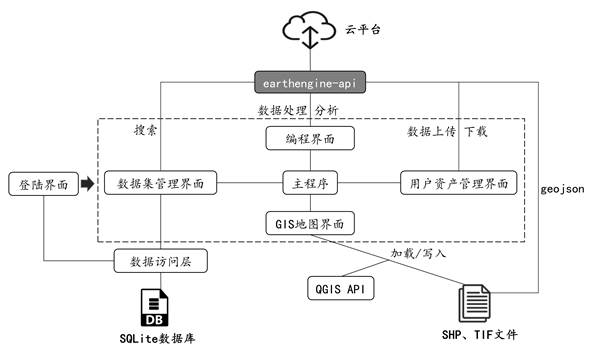

用户验证通过后进入程序的主界面，共分为数据集管理界面、用户资产管理界面、GIS可视化和交互界面、编程界面。其中GIS可视化界面基于Qt框架进行开发，GIS数据的处理和交互基于QGIS进行开发，具备加载矢量、栅格和在线数据的功能，同时用户能在该界面完成数据浏览、矢量数据的创建和编辑等GIS操作。借助于earthengine-api系统还具备加载gee数据集的功能。

在编程界面中用户能根据提供的python编程环境进行编程，借助于代码高亮、快捷注释、打开文本文件等工具来优化用户体验。在编程分析中，用户能调用云计算等数据分析库，能调用用户绘制的几何对象，也能向地图控件添加和删除图层。

用户资产管理界面具备展示当前用户信息和最近项目记录、上传导入云平台数据的功能。通过简洁的界面和交互操作来辅助用户进行数据管理。数据集管理界面具备根据关键字在线查询数据、将查询数据导入数据库、编辑数据库数据条目、更新数据库、可视化数据条目的功能，检索云平台的数据的功能基于云平台提供的相应服务接口进行开发。

**三、** **软件功能描述**

**3.1** **登陆注册功能**

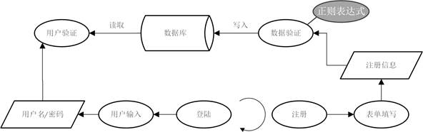

 

登陆模块会结合本地数据库里的用户数据对用户身份进行核验，验证通过后会关闭登陆窗口并加载后续数据分析界面。用户的注册需要用户输入用户名、密码、邮箱、Gmail邮箱，用户输入的合法性通过正则表达式来进行验证，验证通过后会将相关用户信息进行入库，并对用户名重复等异常输入进行提醒。

**3.2 GIS****数据浏览交互功能**

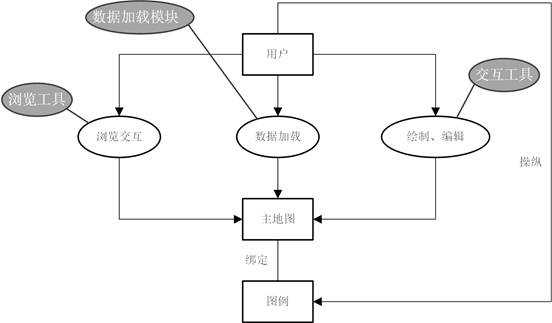

GIS数据展示和交互界面采取经典的桌面端GIS风格进行设计开发，分为展示数据的主地图、控制图层的图例控件、展示经纬度等状态信息的状态栏、工具栏、菜单栏、相关工具停靠栏。用户选择相应交互工具后，通过对用户的鼠标和键盘事件进行监听，实现对应的交互工具，主要有：地图漫游、放大缩小等浏览工具；geometry绘制、顶点编辑等样本绘制、矢量编辑工具。

**3.3** **数据加载功能**

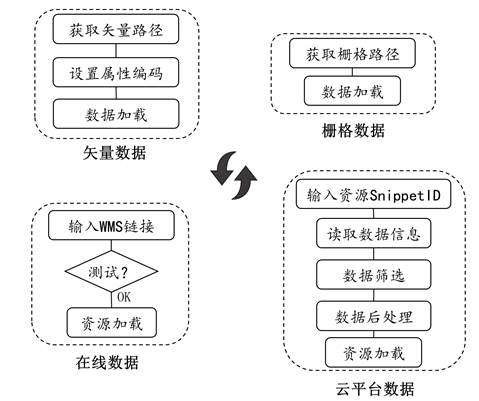

数据加载分为矢量数据、栅格数据、在线数据、云平台数据加载4个部分，而对卫星影像等底图的加载则是利用基于内置的WMS链接来对在线数据进行加载。矢量数据和栅格数据的加载通过文件选择对话框进行文件路径的选择和加载，其中矢量数据支持加载后缀为geojson\shp格式的矢量文件，栅格数据支持后缀为tif\tiff\jpg\png格式的文件，矢量数据加载相比栅格数据多了一步选择字符编码的步骤；在线地图数据通过WMS链接进行加载，完成链接的可用性测试后对数据进行加载；对于云平台数据的加载，需要提供对应数据的SnippetID，其可通过数据集管理界面或相应网站进行查询，系统会根据数据集ID读取其相应信息，并根据用户设置的时间区间、位置区间、波段组合等进行数据过滤和加载。系统会为加载的云平台资源统一分配一个对象ID，对象ID能在编程分析中调用。

**3.4** **用户资产管理功能**

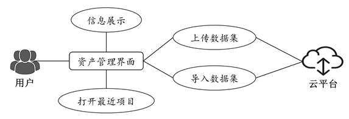

用户资产管理主要管理用户的个人信息、云平台资源、个人日志记录，通过日志记录，用户能在该资源管理界面查看最近登陆信息并打开最近使用的工程文件；通过云平台提供的接口，接入云平台资源管理功能，加载用户的云资源信息并按照目录进行可视化。用户能够导入相关资源并在编程界面使用，也可以选择本地的矢量、栅格文件进行上传。

**3.5** **编程分析功能**

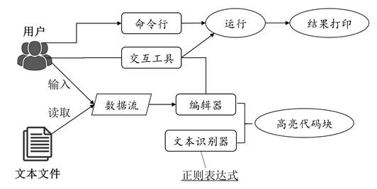

编程分析界面给用户提供了命令行编程、编辑器编程两种选项。命令行适应于用户逐条执行python语句、debug、监视变量状态，编辑器能够打开或新建文件进行编程。通过监视用户的输入，编辑器实时根据正则表达式匹配字符串并进行代码高亮，同时将检索、快捷注释、运行等常用编程工具集成到编程工具栏中以增强编程体验。编程界面相对独立，同时与云平台资源管理界面、GIS界面有联系，用户能够在编程界面对GIS界面导入、绘制、加载的对象或图层进行调用，也能使用到云平台资源管理界面中用户导入本地工作台的资源。

**3.6** **遥感数据集管理功能**

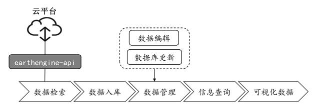

遥感数据集管理功能封装到管理界面中，支持数据检索、检索数据入库、数据库更新、数据集信息编辑、数据库查询功能、查询结果可视化功能。通过接入云平台，用户能够利用关键字进行资源检索，系统会以数据表形式展示检索到的数据。根据需求用户可将筛选到的感兴趣数据集插入到数据库中，方便后续使用查询。考虑到某些数据的信息可能会发生变化，用户还可同步更新数据库保持数据同云平台一致。数据库使用轻量级且Qt内置的SQLite的。对于每条数据记录，用户可对其进行可视化，界面会呈现出该条数据集的相关描述和示例图片。

**3.7** **对象绘制功能**

对象绘制通过监听用户的鼠标事件进行开发，具体在矢量编辑、分类样本绘制、Geometry对象绘制中使用到。在分类样本和Geometry对象绘制中，系统会将绘制内容封装为geojson字符串对象，并调用执行器构造出一个具体的python对象以便于后续编程分析调用。

**3.8** **遥感数据处理工具箱功能**

工具箱功能主要是对当前已有工具进行集成封装，包括矢量工具、栅格工具、云计算工具、数据导出工具等，其对工具进行分类并提供每个工具的打开接口。系统随着使用和更新可能会有工具的增删，工具箱的拓展性可以兼顾到这一点。

**四、** **用户接口**

**4.1****登陆注册页面**

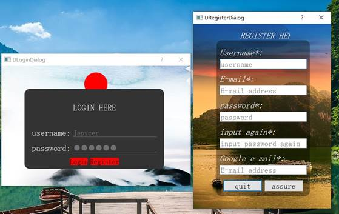

登陆界面是程序的入口界面，用户输入用户名和密码后点击“Login”按钮，验证成功会关闭当前窗口并进入主界面。点击注册按钮进入注册界面，带“*”为必填信息，且每个输入框会进行判断输入是否合法，包括用户名是否合法、邮箱是否合法、密码合法性即两次密码一致性，每个输入检查失败会有红色文字提示，检查通过后点击“assure”按钮即可注册用户并用于登陆。

**4.2 GIS****数据操作界面**

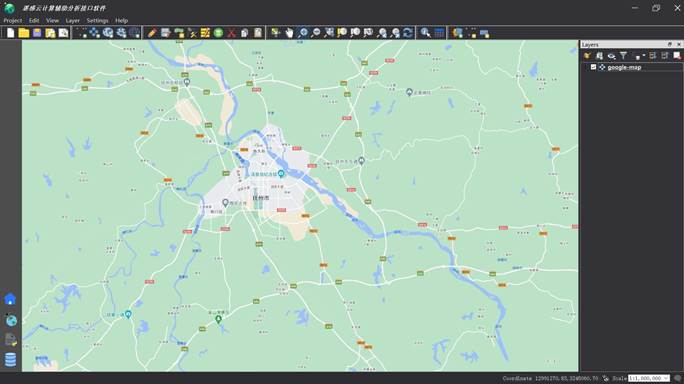

GIS数据操作界面分为上部菜单栏、工具栏，中部地图显示窗口，下部状态栏、左下界面切换按钮、右部图例控件。菜单栏分为Project(项目加载保存、文件打开保存、图层导出)、Edit(矢量编辑中的Feature复制、移动、顶点编辑、删除、矢量选择)、View(图层隐藏、地图放大缩小、缩放至图层)、Settings、Help。一些常用的工具整理在工具栏中，依次包括：文件项目相关工具、数据加载工具、矢量编辑与绘制工具、地图浏览工具、矢量识别与属性表工具、图层创建与数据加载工具。右侧图例可进行图层管理(图层顺序、图层可见性、图层删除、图层信息查看)，与地图一对一绑定绑定。左下点击可切换用户资产管理界面、GIS数据操作界面、编程分析界面、数据集管理界面。

**4.3****用户资产管理界面**

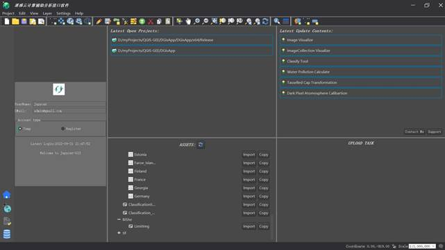

资产管理界面包括左侧用户信息展示界面，右侧的最近项目记录、软件最近更新内容、用户资产查看与导入、数据上传共4个模块。其中用户信息展示部分只能进行查看而不能显示；双击最近项目记录可以打开某个以qgz结尾的工程文件；在软件最近更新部分可查看软件更新内容和联系开发人员；数据上传部分可查看用户最近上传的文件记录，拖动后缀名为zip、tif的文件到此处可将文件上传到接入的云计算平台。

**4.4****编程分析界面**

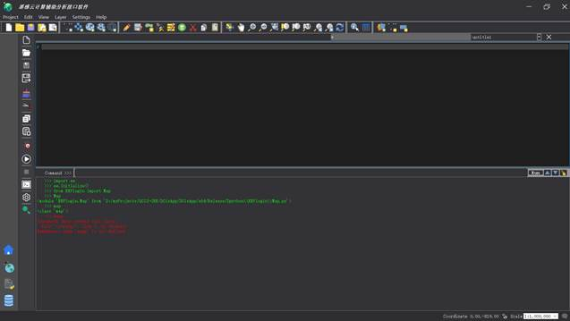

编程分析界面分为左侧工具栏、右侧代码编辑区域、下侧停靠命令行和输出区域、右上的文件调整区域。左侧工具栏从上到下依次为文件新建、打开、保存、另存为、清空编辑区、裁剪选中代码段、复制、粘贴、快捷注释、运行、暂停运行、打开控制台、设置、代码查询，其中打开控制台能够对命令行和输出界面进行显示隐藏；右上可对多个打开的文件进行选择显示、也可删除当前显示界面。

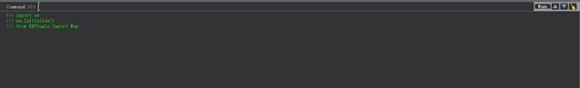

在“command >>>”后输入单条python语句，可通过上下键或右侧上下箭头按钮进行历史语句的加载，点击“run”后会运行代码并将结果输出到下方显示区域，绿色为正确运行输出结果，红色为报错输出。

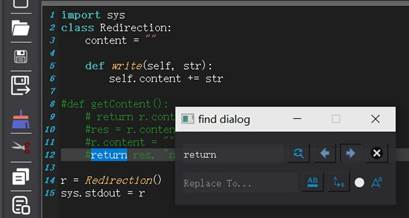

点击工具栏的放大镜按钮会加载搜索对话框，可对任意字符串进行搜索并将搜索匹配结果蓝色底纹标出，点击搜索对话框的左右箭头进行多个搜索结果的切换。也可选中忽略大小写按钮进行搜索，并可在替换输入框中输入替换的单词，点击替换或全部替换按钮对搜索结果进行替换。

**4.5****数据集管理界面**

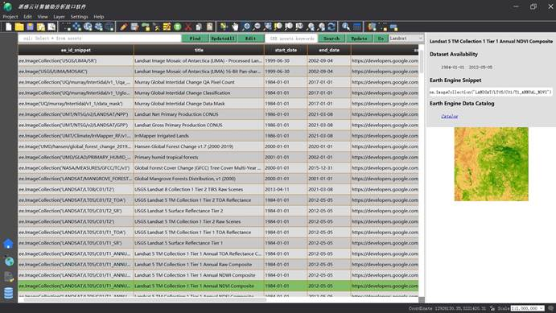

数据集管理界面分为上部输入与按钮区域、主体数据展示区、右侧数据预览区域。输入搜索关键字并点击“Search”按钮，会对云平台上的数据进行检索并将搜索结果展示。点击“Update”将搜索到的数据保存到数据库中。输入SQL语句后点击“Find”会对本地数据库数据进行查询显示，点击UpdateAll会同步本地数据库中的数据与云平台一致。选中某条数据，点击“Go”会展示该条数据集的时间范围、图片概览信息。

**4.6** **底图与GEE数据加载界面**

数据集加载界面可以对以下数据进行加载：

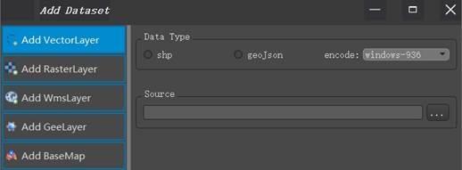

 从“shp”或“geojson”中选择待加载数据集的格式，并通过下拉框选择矢量数据属性表的编码格式，然后选择文件所在路径进行矢量数据的加载。

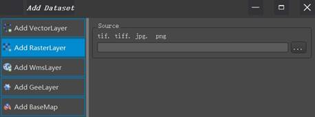

栅格数据直接通过文件浏览对话框选择后缀为tif\tiff\jpg\png的文件，然后进行加载。

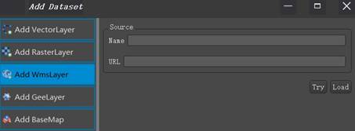

在线数据的加载需要输入URL，并设置图层名，点击“Try”进行可用性测试，测试通过后点击“Load”进行加载。

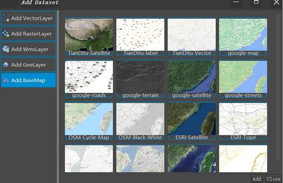

底图加载同在线数据加载同理，系统配置文件预置了一些常见底图数据的URL，包括天地图、Google、ESRI等数据发布商提供的数据。用户单击选中后点击“Add”按钮进行数据加载。

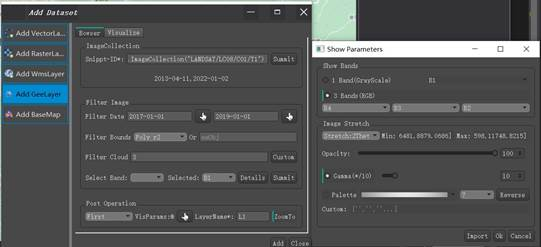

系统默认接入的是GEE遥感云平台，在Snippt-ID输入框输入数据集的唯一ID，点击右侧“Summit”按钮进行数据读取并将数据集的时间范围信息展示在下部区域。若加载的是ImageCollection，还可在Filter Image部分按照时间范围、边界范围、图像含云量对数据集中的若干Image进行过滤。其中Filter Bounds会自动识别用户绘制的Geometry对象，也可手动输入Python对象名。点击“Summit”按钮后会弹出对话框显示过滤后的数据集大小。

在Post Operation部分能对筛选后的图像进行预处理加载，包括只显示第一幅Image、Mosaic合并等，并通过VisParams设置图像显示的波段数、图像拉伸的比例、图像透明度等显示参数。

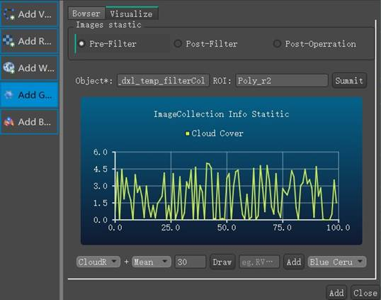

点击“Visualize”界面进入数据概览界面，这里可对数据集的一些参数进行绘图，例如对Filter处理后的数据集的平均云量覆盖率进行绘制，设置分辨率后点击“Draw”即可按照时间顺序得到数据集中每幅遥感的云量覆盖百分比。此外还可自定义计算公式后点击“Add”绘制其他指数的变化曲线，格式如: RVI:$4$/$3$。最后设置图层名并点击“Load”进行数据加载，地图会默认缩放至加载的图层。

**4.7** **对象绘制与管理界面**

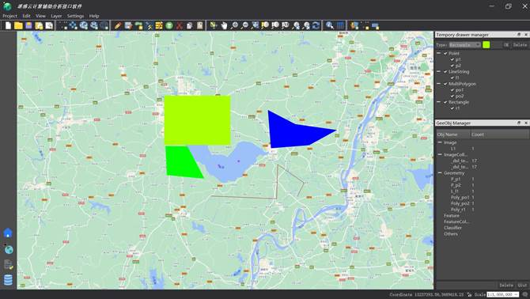

通过“Tempory drawer manager”工具进行对象绘制，选择将要绘制的Geometry类型和显示颜色，鼠标右键结束绘制并自动弹出对话框并提示用户输入对象名，系统会将绘制的对象自动转换成GEE对象。通过“GeeObj Manager”工具可以看到用户绘制的对象、数据加载等工具引入的对象，一些系统自动创建的对象也会统一在这里进行展示。

**4.8** **分类样本选取界面**

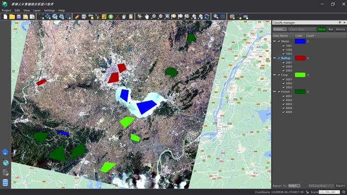

分类样本选取工具是进行图像分类等遥感分析的常用工具，通过“Classify Manager”工具可以进行样本的绘制。首先新建地物类别和绘制颜色，点击“New”新建一个类，此刻点击工具栏上的样本绘制工具进行样本绘制。样本绘制完成后程序会自动分配每个样本的ID值并显示在“Classify Manager”界面的对应地物类别下。所有样本绘制完成后用户可在工具下部“Export To”下拉框选择将样本导出为Shapefile、PyObj、临时图层的形式，设置导出名后进行样本的导出。导出为PyObj则可在编程分析中进行调用，Shapefile会导出到本地磁盘上。

**4.9****工具箱集成界面**

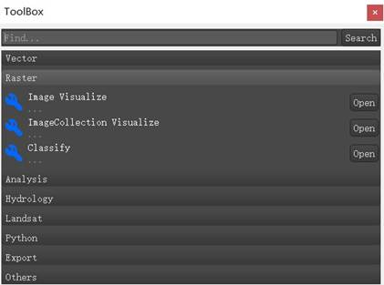

软件的不断更新会内置越来越多的工具，其中数据分析和导出的有关工具大多内置在工具箱“ToolBox”中，右键工具栏可显示工具箱并默认停靠在界面右下。ToolBox上部可输入工具名进行工具检索，点击每个工具后的“Open”按钮会打开对应工具。

**五、** **软件运行环境**

**5.1****硬件环境**

PC机 

内存8G

硬盘500G

**5.2****软件环境**

​     操作系统:windows 7、8、10、11。